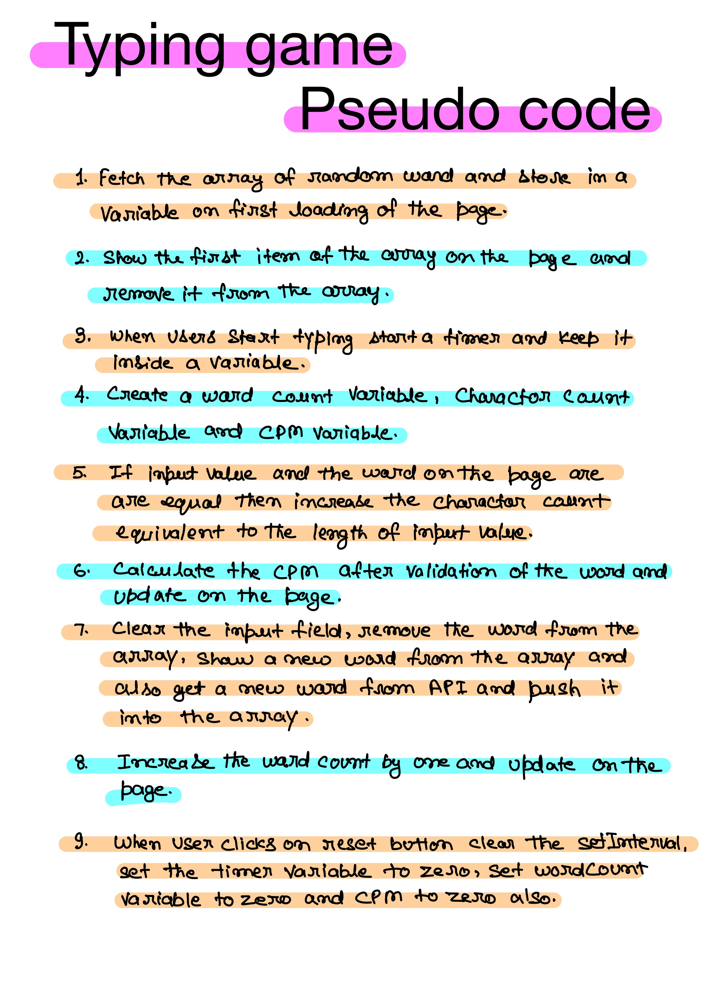
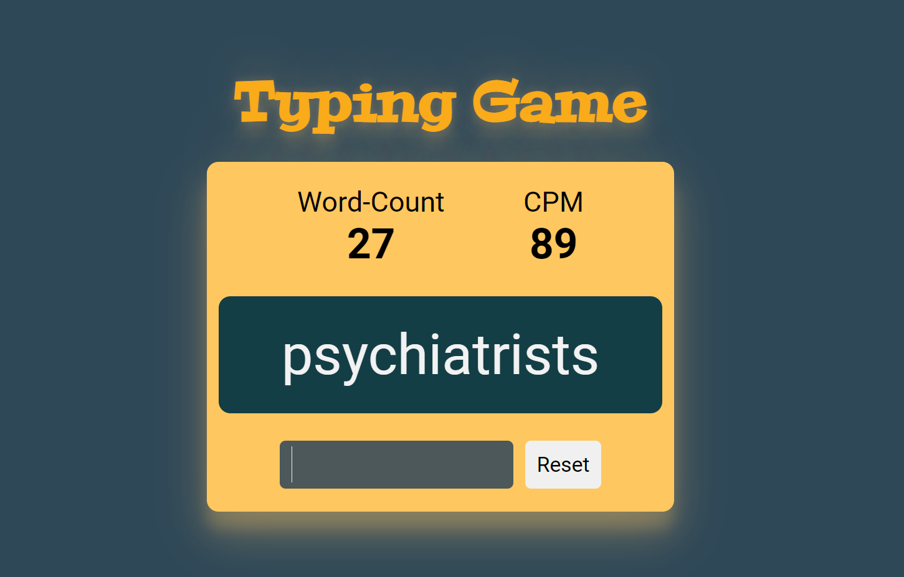

# Typing Game

- I used HTML, CSS, and JavaScript in this project. 

- It took me around **3 hour** to complete the project.

- Learned to fetch data from API (Random word)

- Learned about `setInterval()`

 

## Pseudo code

### Live link

- [Click me](https://my-typing-game.vercel.app/) to view the project.

**Used in Project**

### Preview

